# Introduction to EKF

## Kalman Assumption
- Motion and measurement functions are linear
- State space can be represented by a unimodal Gaussian distribution.

However, most mobile robots will execute non-linear motions. E.g. moving in a circle, following a curve. 

---

## Why can't we apply the KF?

Below is a prior distribution. A unimodal Gaussian distribution with a mean of mu, and a variance of sigma square. When this distribution undergoes a linear transformation, for instance, y=ax+b, the resulting distribution will look like on the right. This posterior distribution is a Gaussian with a mean of a * mu + b, and a variance of a^2 * sigma^2. This is precisely what can happen in a state prediction. A linear transformation that takes in a Gaussian distribution as an input will always output a Gaussian distribution as an output. What if the transformation is non-linear?

	 

  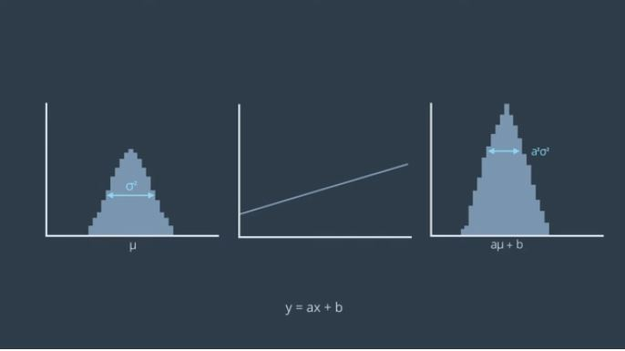

Now, with a non-linear function of atan(x), the resulting distribution is no longer a Gaussian. The distribution cannot be computed in closed form, meaning in a finite number of operations. In order to model this distribution, many thousands of samples must be collected according to the prior distribution, and passed through the function of f(x) to create this posterior distribution.

  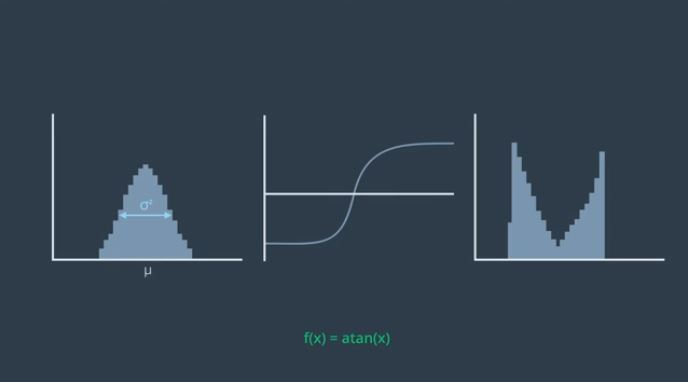

So what can we do? If we look closely into the function, by zooming in, you can see that very small intervals can be estimated as linear function. This will allow us to use the KF on this non-linear problem. The linear estimate is only good for a small section of the function. But, if it's centered on the best estimate, the mean and updated with every step, it turns out it can produce sufficient accurate results.

  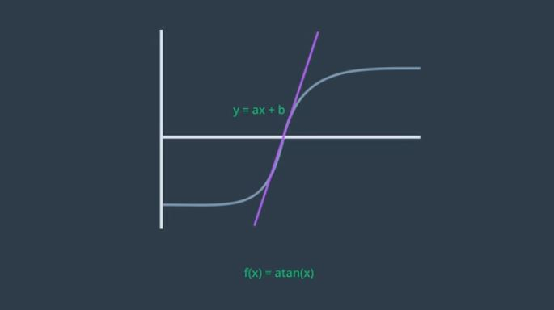

The mean can be continually updated with a nonlinear function. But the covariance must be updated by a linearization of the function f(x). To calculate the local linear approximation, a Taylor Series can be used. A function can be represented by the sum of infinite number of terms. However, an infinite number of terms is not needed. An approximation can be obtained by using just a few of the terms. And a linear approximation can be obtained by using just the first two terms of a Taylor series. This linear approximation centered around the mean, will be used to update the covariance matrix of the prior state Gaussian.

  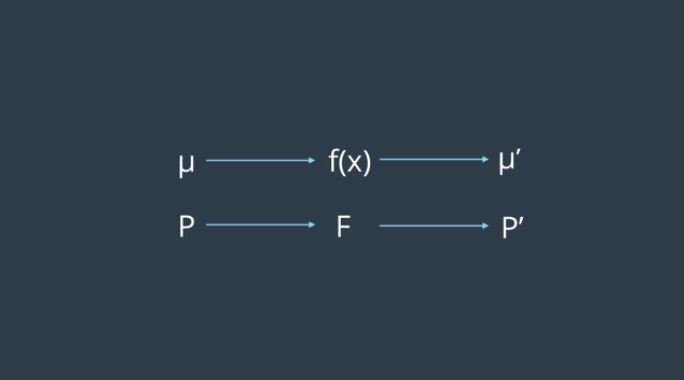

The Taylor series can be simplified as a linear equation, y=ax+b and the transformation can be applied to the prior. Although the result is a Gaussian, it'll inevitably have an error (the result is different to what we saw earlier). However, the tradeoff is in the simplicity and speed of the calculation. 

  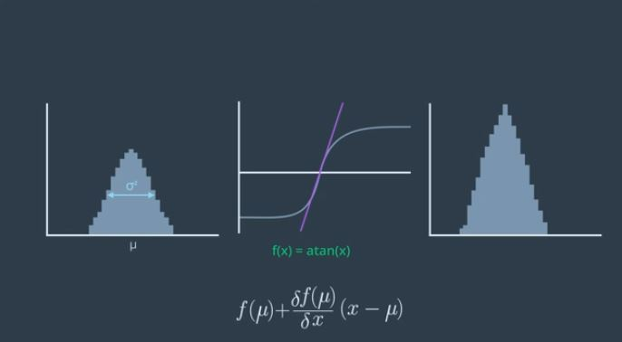

# Recap of KF vs EKF
- Either the state transformation function, or measurement function or both are non-linear.
- These non-linear function can be used to update the mean, but not the variance as this would result in a non-Gaussian distribution. 
- For this reason, locally linear transformation are calculated and used to update the variance.

  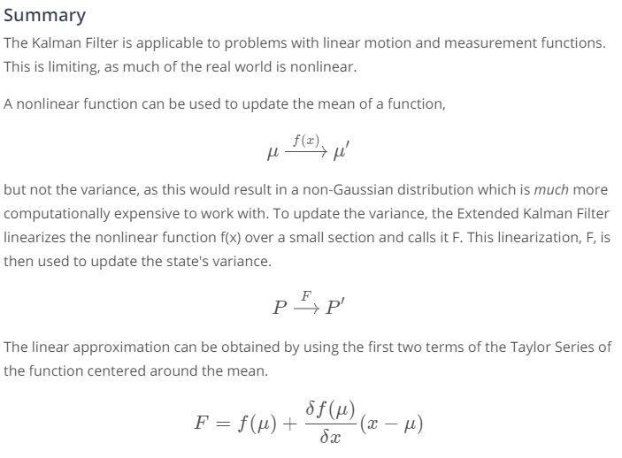

---

  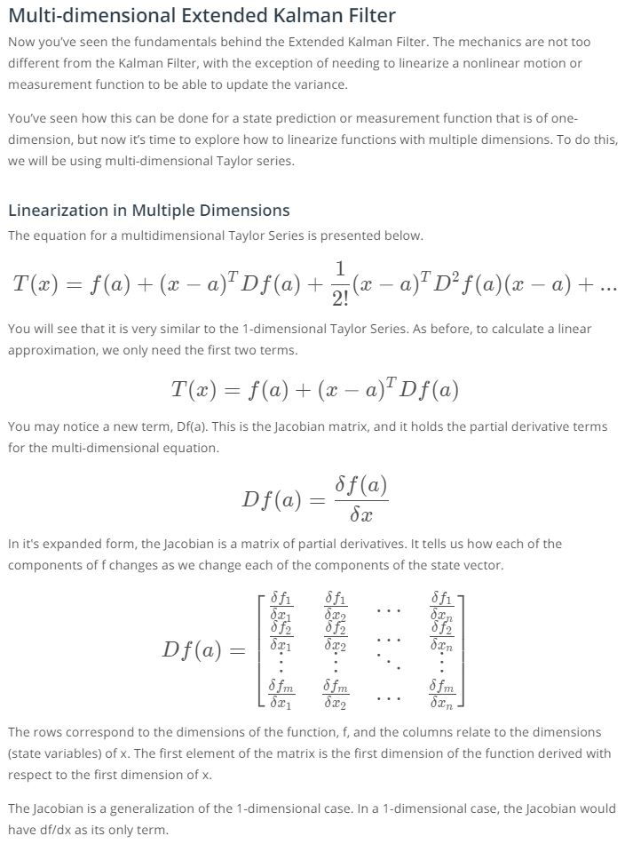

  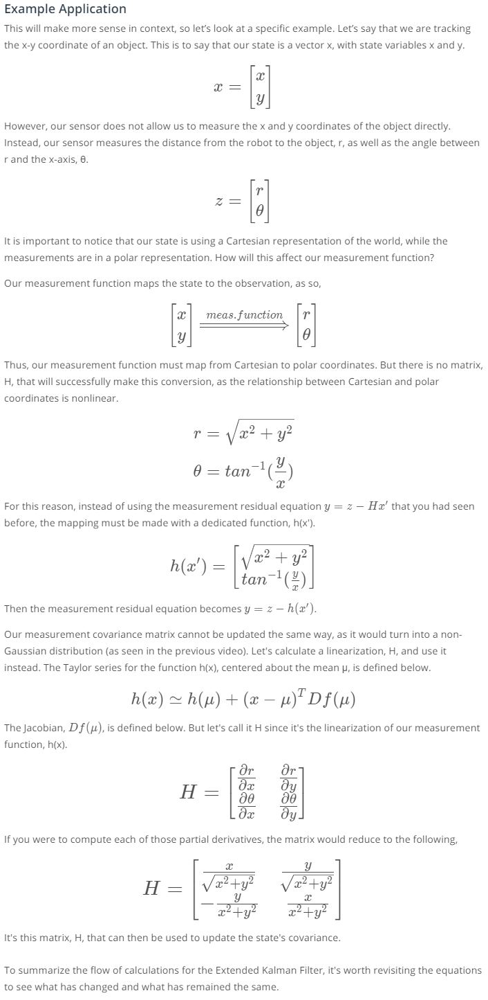

  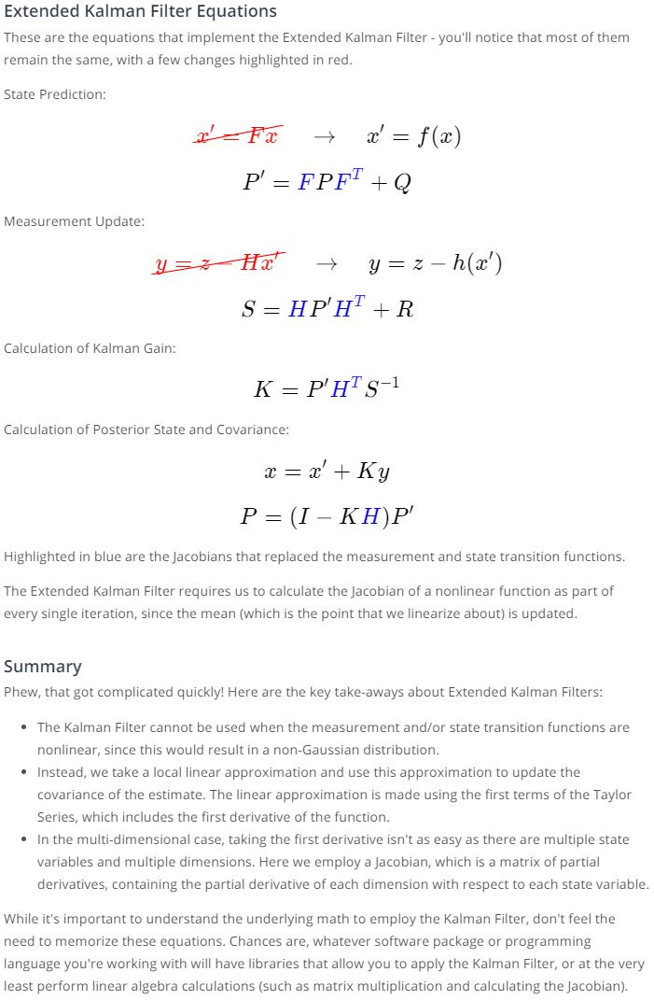

# EKF Example

  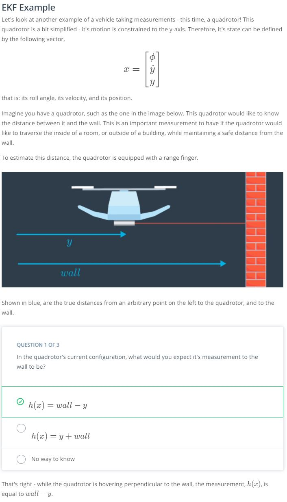

  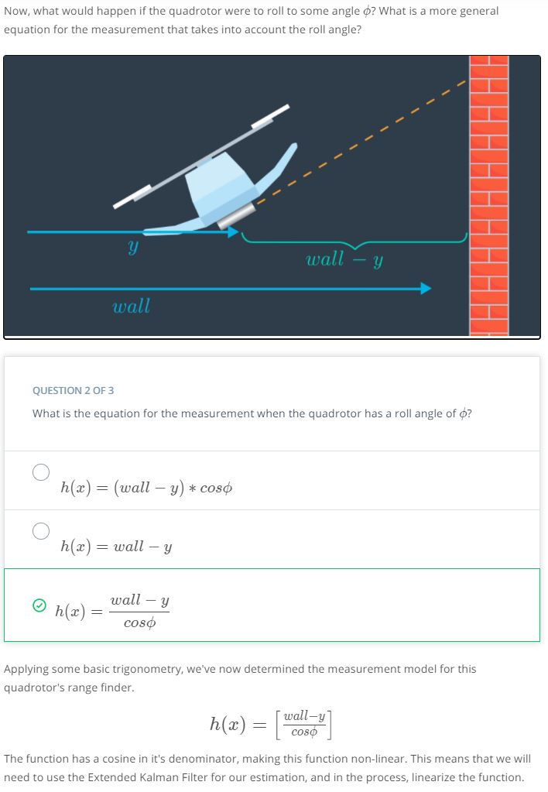

  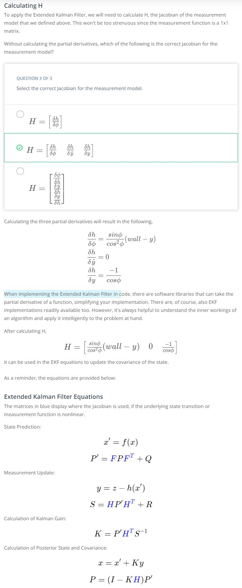

