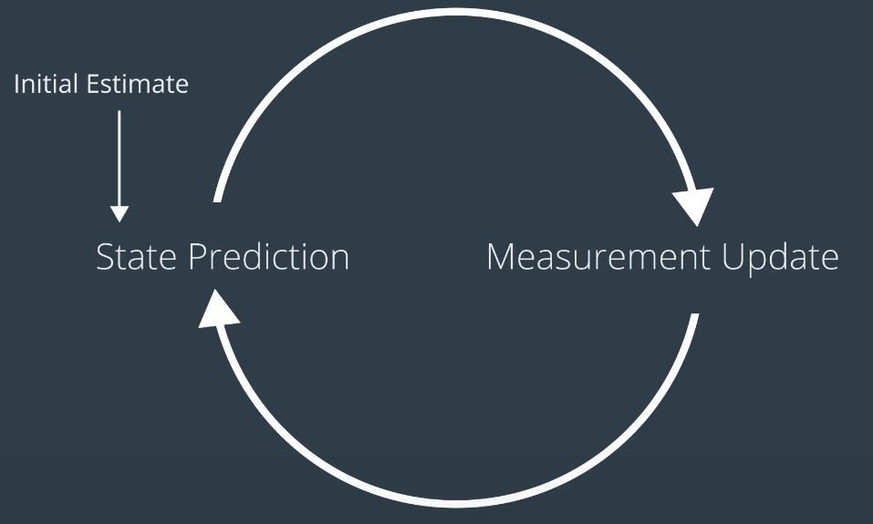
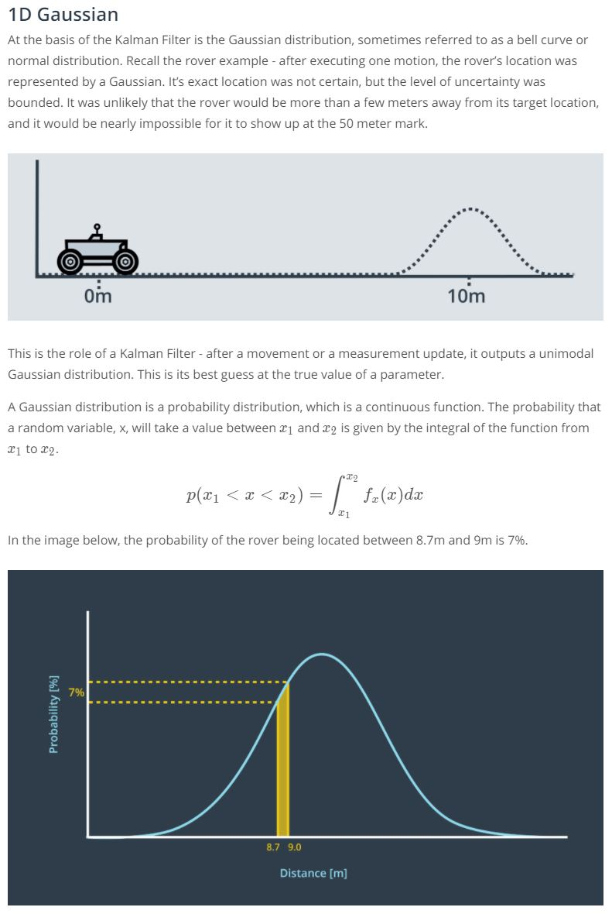
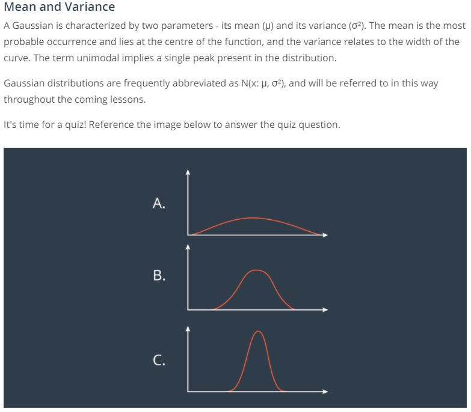
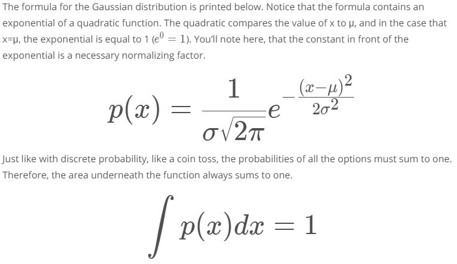
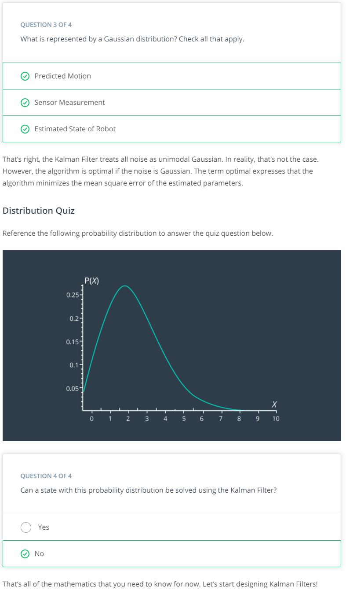

# Kalman Filter

## Overview
Kalman Filter(KF) is an estimation algorithm that is very prominent in controls. It is used to estimate the value of a variable (e.g. position, velocity, temperature etc) in real-time as the data is being collected. It can take data with lot of uncertainty or noise in the measurement and provide a very accurate estimate in a fast manner.

  

The KF takes in an initial assumption and noisy measurement as an input and filters out the noisy/uncertainty data. And eventually it distills desired state.

--- 
## Example
Let's say there's an underwater robot measuring pressure as it swims through water. Pressure increases linearly with depth. In real life scenario, the sensor measurement will **NOT** be accurate. There may be fluctuation in the water causing fluctuation in pressure as well as electrical noise from the sensor itself.

  

As pressure sensor starts collecting data, the KF begins to narrow in and estimate the actual pressure. In addition to the sensor readings, the KF also takes into account the uncertainty of the sensor readings which are specific to the sensor and the environment it is operating in. 

  

---
## How does it work?
Iteration of two steps: **Measurement Update** and **State Prediction**. After couple iterations, the estimate will converge on the real value.

- Measurement Update: Use recorded measurement to update the state
- State Prediction: Use the information we currently have about the current state to predict what the future state will be. Initial guess is used for the start.

  

xt : state

zt : measurement

ut : control action

Cycle starts with an initial estimate which can be not accurate. The kalman filter will converge soon and yield good results very quickly. Then we iterate between the measurement update where we gain knowledge about our environment and the state prediction which causes us to lose knowledge due to the uncertainty of robot motion.

### Measurement Update

---
## Types of Kalman Filter

There is a standard Kalman Filter and two variations (EKF, UKF)
- KF - linear
- EKF (Extended KF) - nonlinear 
- UKF (Unscented KF)- highly nonlinear (Not taught in this course)

--- 
## Advantages of KF
- Unlike other algorithms that require a lot of data to make an estimate, a KF is able to do so with only few sensor measurements. It does so by using an initial guess and by taking into account the expected uncertainty of a sensor or movement.
- Let's say a robot is using GPS data to identify its location. Today's GPS measurements are only accurate to a few meters. By only using the GPS data, you cannot obtain an accurate enough estimate of your robot's location. However this can be resolved by use of sensor fusion. Sensor fusion uses the Kalman filter to calculate a more accurate estimate using data from multiple sensors. Kalman filter takes into account the uncertainty of each sensor's measurements. 

---

  

  

  

  

