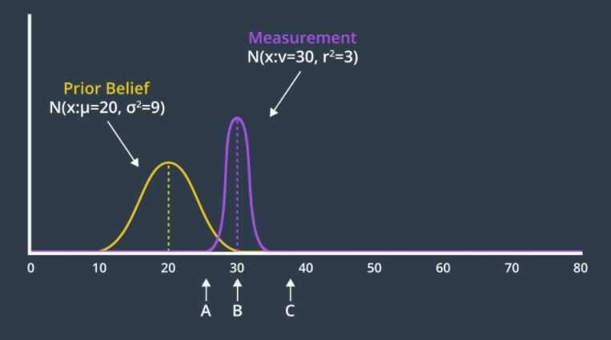
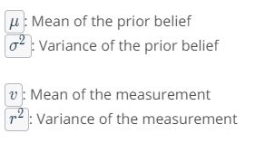
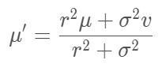
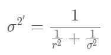
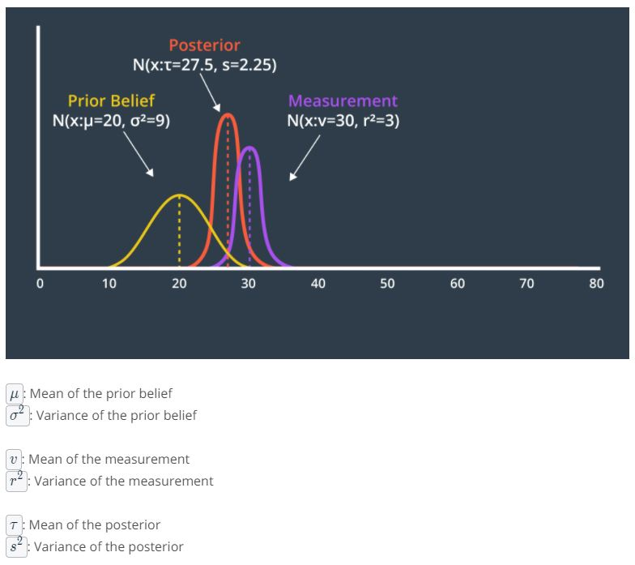
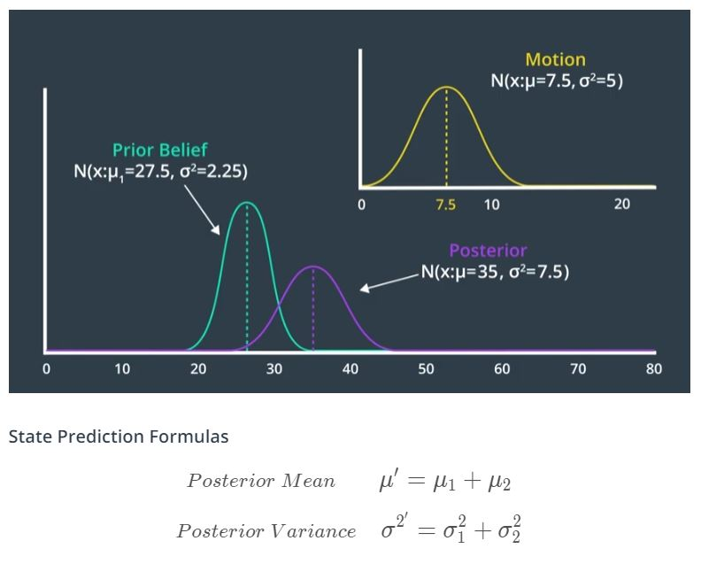
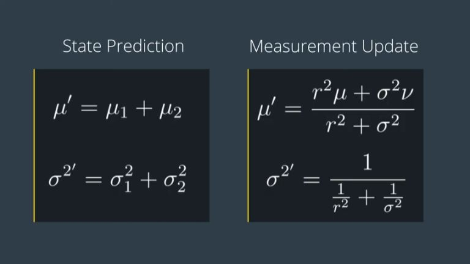

# How does it work?
Iteration of two steps: <span style="color:yellow">**Measurement Update**</span> and <span style="color:yellow">**State Prediction**</span>. After couple iterations, the estimate will converge on the real value.

- Measurement Update: Use recorded measurement to update the state
- State Prediction: Use the information we currently have about the current state to predict what the future state will be. Initial guess is used for the start.

<p align="center">
  
</p>

x<sub>t</sub> : state

z<sub>t</sub> : measurement

u<sub>t</sub> : control action

---
## Measurement Update
Cycle starts with an initial estimate which can be not accurate. The kalman filter will converge soon and yield good results very quickly. Then we iterate between the measurement update where we gain knowledge about our environment and the state prediction which causes us to lose knowledge due to the uncertainty of robot motion.# Measurement Update

Assuming that the robot went roaming around, the prior belief is set to 20. This is where I believe the robot is. Then the robot takes in the sensory measurement providing us with data to work with. The measurement data 'Z' is more certain so it appears as a narrower Gaussian with a mean of 30.

<p align="center">
  
</p>
<p align="center">
  
</p>

The new belief will be located as shown below. The new mean is a weighted sum of the prior belief and measurement means. With uncertainty, a larger number represents a more uncertain probability distribution. However, the new mean should be biased towards the measurement update, which has a smaller standard deviation than the prior. How do we accomplish this?

<p align="center">
  
</p>
	 

The answer is - the uncertainty of the prior is multiplied by the mean of the measurement, to give it more weight, and similarly the uncertainty of the measurement is multiplied with the mean of the prior. Applying this formula to our example generates a new mean of 27.5, which we can label on our graph below.

The two Gaussians provide us with more information together than either Gaussian offered alone. As a result, our new state estimate is more confident than our prior belief and our measurement. This means that it has a higher peak and is narrower. You can see this in the graph below.

<p align="center">
  
</p>
	 

<p align="center">
  
</p>

---
## State Prediction

Previously set posterior belief (mean: 27.5, variance: 2.25) now becomes the prior belief. This is the best estimate of the robot's current location. Next the robot executes a command, move forward 7.5m. The result of this motion is a Gaussian distribution centered at 7.5m with a variance of 5m. The calculation for posterior mean and variance is shown below.

<p align="center">
  
</p>

---
## Review
<p align="center">
  
</p>

```c++
#include <iostream>
#include <math.h>
#include <tuple>

using namespace std;

double new_mean, new_var;

tuple<double, double> measurement_update(double mean1, double var1, double mean2, double var2)
{
    new_mean = (var2 * mean1 + var1 * mean2) / (var1 + var2);
    new_var = 1 / (1 / var1 + 1 / var2);
    return make_tuple(new_mean, new_var);
}

tuple<double, double> state_prediction(double mean1, double var1, double mean2, double var2)
{
    new_mean = mean1 + mean2;
    new_var = var1 + var2;
    return make_tuple(new_mean, new_var);
}

int main()
{
    //Measurements and measurement variance
    double measurements[5] = { 5, 6, 7, 9, 10 };
    double measurement_sig = 4;
    
    //Motions and motion variance
    double motion[5] = { 1, 1, 2, 1, 1 };
    double motion_sig = 2;
    
    //Initial state
    double mu = 0;
    double sig = 1000;

    for (int i = 0; i < sizeof(measurements) / sizeof(measurements[0]); i++) {
        tie(mu, sig) = measurement_update(mu, sig, measurements[i], measurement_sig);
        printf("update:  [%f, %f]\n", mu, sig);
        tie(mu, sig) = state_prediction(mu, sig, motion[i], motion_sig);
        printf("predict: [%f, %f]\n", mu, sig);
    }

    return 0;
}

```