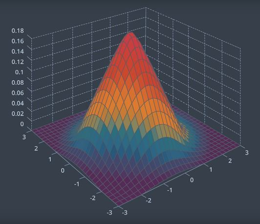
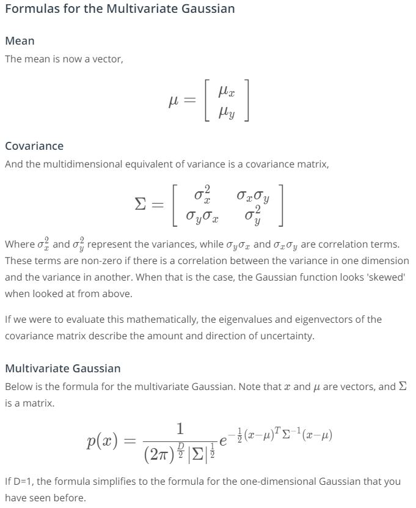
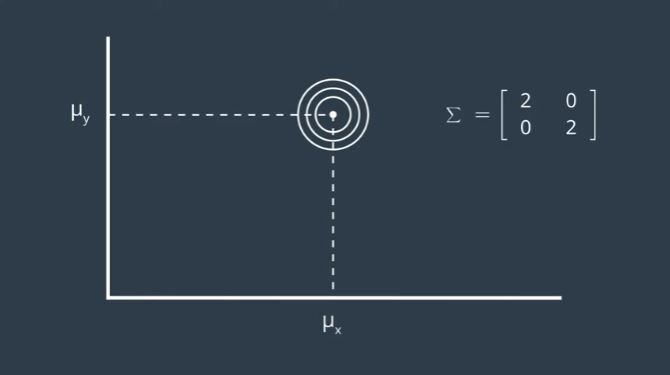
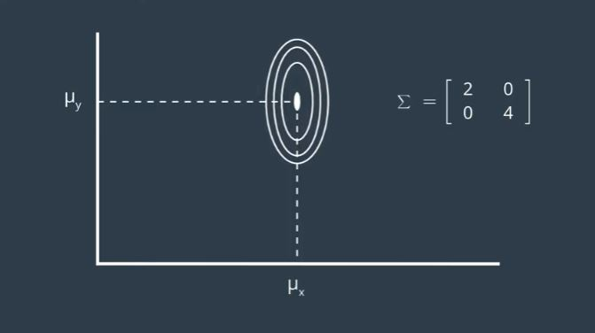
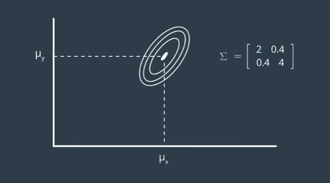

# Multivariate Gaussian

Below depicts a two-dimensional Gaussian distribution.

  

Unlike 1D, 2D has two mean values, one for each of the two dimensions. N dimensional Gaussian will have Nx1 mean values. The covariance matrix represents the spread of the Gaussian in 2 dimensions. N dimensional Gaussian will have a NxN covariance matrix. The covariance matrix is always symmetrical.

  

--- 

Below are few examples of 2D Gaussian. The means have been fixed to arbitrary point and the values of the covariance matrix are manipulated. 

  

If the variances of x and y are equal and both small, the 2d Gaussian representation will be circular. If so, you are equally certain of the location of the object in each dimension.

  

 However, you may be certain about the location of the object in the x-axis but not in the y-axis. Then the contour shape of the Gaussian will start looking more like an oval shape. Notice that the correlation terms are zero. 

  

If the correlation terms are non-zero, the two-axis are correlated, hence creating a screwed oval. Depending on whether the terms multiply out to a positive value or a negative value, the oval will screw to the right or left respectively. Then once you gain information about one axis, it'll reveal information about the other axis, due to the correlation. The multivariate Gaussian can be modeled with the equation above.

